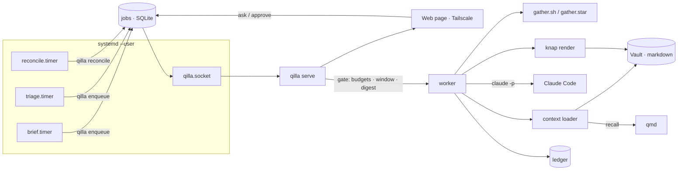
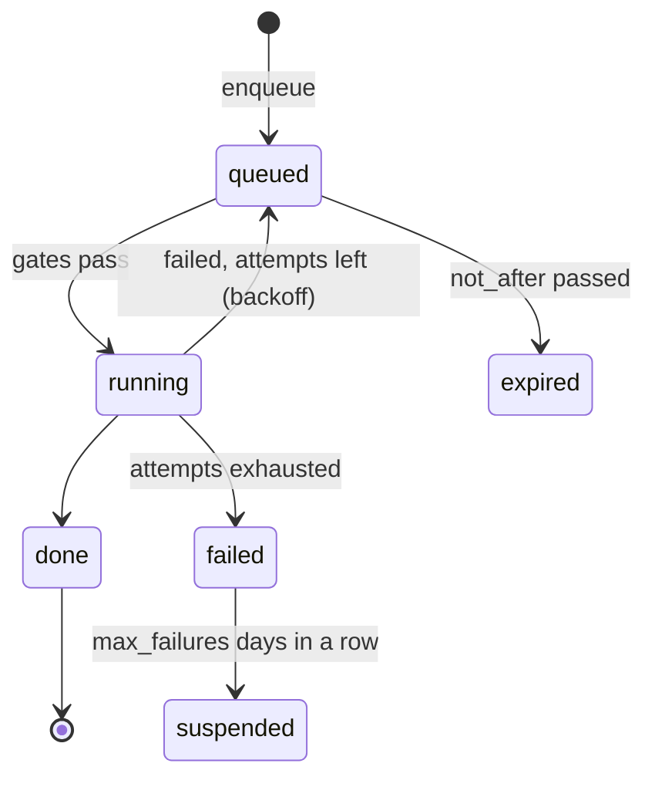

# qilla

qilla is a single Go binary that turns **Claude Code + a markdown vault** into scheduled, budgeted work on your own Linux box. You describe a *routine* — when it runs, what it gathers, whether it needs a model, what note it writes — and qilla does the rest: a systemd timer enqueues it, a socket-activated supervisor drains the queue, the run is priced against a daily budget, and the result is rendered into your vault by a template. Most routines never call a model at all; the ones that do only call it when their input actually changed.

**Status:** building. Interfaces still move.

- Installing with an AI agent: [AGENTS-INSTALL.md](AGENTS-INSTALL.md)
- Every config key with comments: [`qilla.example.toml`](qilla.example.toml)

## Requirements

**Linux with systemd only.** qilla is not portable and does not pretend to be: scheduling is systemd user timers, the supervisor is socket-activated, the sandbox is systemd unit hardening, secrets are `systemd-creds`, live sessions are read from `/proc`, and reminders notify through `notify-send`. **macOS is not supported.** Porting it would mean replacing: systemd timers and socket activation → launchd, the unit hardening block → sandbox-exec (no equivalent for most directives), `systemd-creds` → Keychain, `notify-send` → terminal-notifier, `/proc` scanning → `ps`/libproc, and `systemd-analyze security` → nothing. That is a real project, not a flag.

| Needs | Why | When |
|---|---|---|
| systemd user session, `loginctl enable-linger` | timers, socket activation, unit sandbox | always |
| systemd ≥ 250 | `systemd-creds` for `qilla secret` | to use secrets |
| Claude Code CLI on PATH, logged in once (`claude`, then `/login`) | every AI turn is `claude -p` | always |
| a vault directory (markdown, Obsidian-shaped) | memory, persona, routines, output | always |
| Go ≥ 1.27 | building from source (`mise.toml` pins 1.27.1) | to build |
| [mise](https://mise.jdx.dev) + node 24 | pins the runtime tools the unit sees (claude, knap, qmd, engram) | recommended |
| `bubblewrap` and `socat` | Claude Code's own Bash sandbox and its network allowlist | unless `[sandbox] disabled = true` |
| [knap](https://github.com/obsidianmd/knap) | renders a routine's JSON into a note | any routine with `output`/`template` |
| [qmd](https://www.npmjs.com/package/@tobilu/qmd) | the default `recall_cmd` | routines using the `recall:` scope |
| `libnotify` (`notify-send`) | `qilla remind due --notify` | desktop reminders |
| `git` | `commit = true` on a routine | optional |

`qilla doctor` checks all of this and names the missing piece. No `jq` anywhere: gathers speak JSON natively.

## Quick start

```sh
go install github.com/jalberto/qilla/cmd/qilla@latest     # or from source: git clone … && go build ./cmd/qilla
qilla init
```
`qilla init` writes `~/.config/qilla/qilla.toml`, a runtime `~/.config/qilla/mise.toml`, a status line script, and the systemd user units (`qilla.socket`, `qilla.service`, `qilla-reconcile.timer`, one `qilla-<routine>.timer` per configured routine). It prints the exact enable commands. Existing TOML files are never overwritten without `--force`; `--print` just dumps the template.

```sh
$EDITOR ~/.config/qilla/qilla.toml       # vault path, timezone, budgets, agents, routines
mise install -C ~/.config/qilla && mise exec -C ~/.config/qilla -- npm i -g knap @tobilu/qmd
systemctl --user daemon-reload
systemctl --user enable --now qilla.socket qilla-reconcile.timer   # init prints the full line
loginctl enable-linger $USER
qilla prices sync                        # price sheet, so runs get a cost
qilla doctor                             # one line per check; red means act, exit 1 on a hard failure
```

First routine:

```sh
qilla new routine calendar-today --kind script --schedule "*-*-* 06:30" \
  --window 06:00-09:00 --output "Desk/Journal/{{date}}.md" --append
# prints the files it wrote under <vault>/Qilla/Routines/calendar-today/
qilla gather calendar-today              # runs only the gather step, prints its JSON — $0, no model
qilla init && systemctl --user enable --now qilla-calendar-today.timer
qilla run calendar-today                 # one real run now, bypassing the queue; then read the note
```

Then talk to it: `qilla chat` opens Claude Code in the vault as your agent — persona and rules as the system prompt, the agent's resumed session, a time-of-day opening line, qilla's status bar. `qilla ask "…"` is the headless one-off: it goes through the queue, waits, and prints the answer.

## Components

| Component | What it is |
|---|---|
| **CLI** (`qilla`) | one static binary; every other component is a subcommand of it |
| **enqueue** | what a timer runs: writes one job row to SQLite, dedupes against a job already queued for the routine, pokes the supervisor socket, exits in milliseconds. It never touches Claude, so a firing timer costs nothing |
| **serve** (supervisor) | socket-activated on the first poke; drains the queue one job at a time under a `flock` on the vault, applies the gates (budgets, window, digest), settles jobs, streams SSE to the web page, exits after `idle_exit`. Idle means no qilla process at all |
| **worker** | executes one job: gather → digest check → prompt assembly → `claude -p --output-format json` (AI kinds) → render → ledger record |
| **jobs / queue** | a SQLite table: `queued → running → done \| failed \| suspended \| expired`, priority then due order, retries at 1/5/15 min backoff, suspension after `max_failures` days in a row |
| **routine** | a bundle in `<vault>/Qilla/Routines/<name>/`: `gather.sh` **or** `gather.star`, `template.md`, `prompt.md` for AI kinds, plus its `[routines.<name>]` config block |
| **gather.star** | the default gather: Starlark run in-process by qilla — Python-shaped, JSON-native, read-and-run only, nothing to install. `gather.sh` (any language, prints one JSON object) is the escape hatch |
| **timers** | one systemd user timer per routine plus `qilla-reconcile.timer`; `Persistent=true`, so a slot missed while the machine slept fires on wake |
| **reconcile** | every 30 min and at boot: for each `must_run` routine, ask the ledger "succeeded today?" and enqueue what is missing (once with `late = true` after the window closed). Also purges expired memory |
| **context loader** | assembles a prompt from vault layers in a fixed order (persona, rules, facts, journal, recall, memory, file) and only the declared `scope`. Stable layers first and byte-identical, so the prompt cache hits |
| **ledger and budgets** | every run's tokens (including the 1-hour cache tier), model, cost, duration; three daily caps with `warn`/`block` — global, per agent, per routine — checked at dequeue |
| **working memory** (`qilla mem`) | what qilla needs and you never read: run heuristics, "already said" markers, routing hints, notes with a TTL. Human-meaningful facts go to the vault instead |
| **engram** | the default working-memory backend (a pinned Go sidecar, SQLite + FTS5, unix socket); `[memory] backend = "sqlite"` uses qilla's own FTS5 tables instead |
| **reminders** (`qilla remind`) | time-anchored lines living in vault markdown; only "already notified" is state, which is what lets a short timer notify each one exactly once |
| **queues / judge** (`qilla queue`) | one `<family>.jsonl` of candidates per family: flows detect and queue a line, a judge routine drains the family in batch |
| **renderer** | [knap](https://github.com/obsidianmd/knap), Obsidian's own template language. Routines return JSON; templates in the vault turn it into notes, identically every day. The model never formats markdown |
| **doctor / health** | `qilla doctor` checks everything that would make tomorrow morning fail; `--health` is the stack watch alone (watched units, artifact freshness, stuck jobs); `doctor fix` restarts failed watched units |
| **guard** | PreToolUse rails for interactive sessions in the vault: `qilla guard bash` (ask/deny patterns from `[guard]`), `qilla guard read` (whole-file reads above `read_max_lines` denied) |
| **secrets** | `qilla secret set <name>` encrypts with `systemd-creds`; the unit gets `LoadCredentialEncrypted=`, the gather finds the plaintext at `$QILLA_SECRETS_DIR/<name>`, and the model never sees it |
| **statusline** | qilla's own status bar in about 5 ms: model · weekly usage · context · failing checks · reminders due · open questions · today's jots |
| **web chat** | one embedded HTML page over SSE (Chat, Jobs, Today, Cost, Status), bcrypt password from `qilla passwd`, bound to loopback; publish it with Tailscale |
| **plugin / skills** | `qilla plugin install` materialises hooks, the `qilla:routine`/`qilla:research` skills and sub-agents for Claude Code; `[plugins].dirs` loads your own vault plugins into qilla's spawns only |

## Architecture



### Job lifecycle

A suspended routine stays out of the queue until you clear it: fix the cause, then enqueue it again.

### Routine kinds
| Kind | Runs | Files | AI cost |
|---|---|---|---|
| `script` | gather → render | gather + `template.md` | none |
| `ai-fresh` | gather → digest → `claude -p` (new context, scoped) → render | + `prompt.md` | one call, only when the input changed |
| `ai-resumed` | the same on the agent's `--resume` session | + `prompt.md` | one call |

### Memory layers
`scope` is a list of layer tokens, loaded in this order and no other:

| Token | Loads |
|---|---|
| `persona` | the persona file (stable, first) |
| `rules` | the rules file (stable) |
| `facts:<domain>` | `<vault>/<facts_dir>/<domain>.md` |
| `journal:<N>d` | the last N daily notes, compacted (inbox + today bullets + the last 25 log lines of each day) |
| `journal-full:<N>d` | the last N daily notes in full |
| `recall:<N>` | top N results of `recall_cmd` for the routine's query |
| `memory:<N>` | top N working-memory notes for the routine |
| `file:<path>` | one vault-relative file |

Stable layers are byte-identical across runs; dynamic layers come last. That is what keeps the prompt cache warm between runs of the same routine.

## Configuration

Everything lives in one file, `~/.config/qilla/qilla.toml`, written by `qilla init` and validated by `qilla doctor`. [`qilla.example.toml`](qilla.example.toml) documents every key; `qilla config get <dotted.key>` and `qilla config keys` read it back.

| Section | Holds |
|---|---|
| top level | `vault`, `state_dir`, `queue_dir`, `persona`, `rules`, `facts_dir`, `journal_dir`, `todo`, `questions`, `daily_template`, `reply_marker`, `recall_cmd`, `claude`, `timezone` |
| `[budget]` | the global daily `warn`/`block`, USD |
| `[web]` | listen address, bcrypt password hash, `idle_exit` |
| `[chat]`, `[chat.openings]` | interactive defaults: model, effort, autocompact, session rotation, extra Claude args, the opening line per time of day |
| `[models]`, `[models.effort]` | tier → model mapping, the degradation ladder and `degrade_at` |
| `[sandbox]` | Claude's Bash sandbox: `disabled`, `allowed_domains`, plus extra `bind_ro`/`bind_rw` for the unit |
| `[browser]` | headless browser for routines, headed browser for handoff |
| `[plugins]`, `[hooks]`, `[guard]` | your Claude Code plugin dirs, your own hook commands, the PreToolUse rails |
| `[health]` | `watched_services` and artifact `freshness` — what `qilla doctor --health` polices |
| `[artifacts]`, `[tasks]`, `[memory]` | artifact TTL/size, task aging thresholds, working-memory backend and expiry |
| `[agents.<name>]` | model or tier, daily budget, `allowed_tools`, `scope` |
| `[routines.<name>]` | kind, schedule, window, `must_run`, agent/tier, budget, `output`, `commit`, `allowed_domains` |

Two top-level keys worth calling out: **`daily_template`** (default `Qilla/Templates/Daily.md`) is the vault template a daily note is created from when `qilla log` has to make one, and **`reply_marker`** (default `💬 owner:`) is the prefix of a reply line under a queued question, which `qilla catchup` reads back. Both live at the top of the file — see `qilla.example.toml`.

Re-run `qilla init` after changing routines: units are regenerated from the config every time, the TOML files never without `--force`.

## Writing a routine

```sh
qilla new routine calendar-today --kind script --schedule "*-*-* 06:30" --window 06:00-09:00 \
  --must-run --output "Desk/Journal/{{date}}.md" --append
```
This writes `Qilla/Routines/calendar-today/{gather.star,template.md}` in the vault (`--sh` scaffolds a shell gather instead) and a `[routines.calendar-today]` block in `qilla.toml`. Then:

1. Edit the gather until `qilla gather <name>` prints the JSON you want — that step is free.
2. Edit `template.md` (knap) to render it. The model never writes markdown.
3. AI kinds only: add `prompt.md`, set `--agent`/a tier and a budget, then `qilla run <name>` once as the paid proof.
4. `qilla init` for the timer, `systemctl --user enable --now qilla-<name>.timer`, then `qilla doctor`.

A routine is an isolated bundle: its own gather, template and prompt, no helper scripts shared between routines. The `qilla:routine` skill in [`skills/routine/`](skills/routine/SKILL.md) walks a Claude Code session through the design and defaults to no model at all. Worked bundles live in [`examples/routines/`](examples/routines).

## Command reference

| | |
|---|---|
| `qilla init [--force] [--print]` | config, runtime mise.toml, status line, systemd units |
| `qilla doctor [--json]` · `doctor --health [--count]` · `doctor fix` | every check that would make tomorrow fail · the stack watch alone (exit 1 if anything is wrong) · restart failed watched units |
| `qilla version` · `qilla help` | version · usage |
| `qilla new routine <name> …` | scaffold a routine bundle and its config block |
| `qilla gather <routine>` | run only the gather step and print its JSON — no model, $0 |
| `qilla run <routine>` | one routine now, bypassing the queue |
| `qilla enqueue <routine>` · `qilla enqueue ask --text "…"` | what timers and the page do |
| `qilla ask "<text>"` | headless one-off through the queue; waits and prints |
| `qilla chat` (alias `attach`) | Claude Code in the vault as the agent: persona, tools, resumed session, openings |
| `qilla serve` | the supervisor (socket-activated; you rarely run it by hand) |
| `qilla reconcile` | prove today's `must_run` routines; purge expired memory |
| `qilla status [--short\|--json]` | the day at a glance; exit 1 when something needs you |
| `qilla runs last <routine>` · `qilla runs log [--routine r] [--days n]` | the watermark gathers diff against · recent runs with cost, duration and error head |
| `qilla cost [--all] [--by routine\|agent]` · `qilla prices sync` | money · refresh the price sheet |
| `qilla mem add\|search\|seen\|forget\|recent\|conflicts\|judge\|promote\|purge\|stats` | working memory |
| `qilla task new\|find\|done\|open\|aging\|summary` | one task, one block id, kept in sync across every note that copies it |
| `qilla queue add\|list\|count\|drop` | judge candidate queues (`count` exits 1 when anything is queued, so hooks can branch) |
| `qilla remind add\|list\|due [--notify]\|count\|reset` | time-anchored reminders |
| `qilla catchup [--all]` | what changed in the vault since this agent last caught up |
| `qilla note <path> [--section "<heading>"] [--tail N] [--frontmatter]` | print a note, or one section of it, instead of reading it whole |
| `qilla log "<text>" [--date YYYY-MM-DD]` | append a timestamped line to the daily note's log section |
| `qilla config get <dotted.key>` · `qilla config keys` | read-only config |
| `qilla sessions [--count\|--others\|--count-others\|--rotated]` · `qilla sessions handoff` | live Claude sessions in the vault, read from `/proc` · hand context to the next one |
| `qilla secret set\|list\|rm` | encrypted secrets for the gather step |
| `qilla artifact add\|list\|rm` | HTML artifacts served under the page |
| `qilla browser <args>` · `qilla browser handoff <url>` | headless browsing with a profile per agent · open the same profile headed |
| `qilla model [tier]` | the resolved model per tier and the current usage degradation |
| `qilla plugin [install]` · `qilla plugin usage [--unused] [--json]` | the Claude Code plugin · skill use counts |
| `qilla statusline` · `qilla guard …` · `qilla hook …` | the status bar and the plugin's hooks (called by Claude Code, not by you) |
| `qilla passwd` | set the web password |

## Safety model

Two sandboxes, both native to a Linux box:

1. **The systemd unit.** Every `claude -p` and every gather runs inside `qilla.service`, whose home is an empty tmpfs. Only the vault, qilla's state and config, Claude's own files and the toolchain are bound in; `~/.ssh` and the rest simply do not exist for a routine. `ProtectSystem=full`, `ProtectHome=tmpfs`, `PrivateTmp`, `NoNewPrivileges`, no capabilities, `ProtectProc=invisible`. Extra binds come from `[sandbox] bind_ro`/`bind_rw`; `qilla doctor` prints the `systemd-analyze security` exposure score.
2. **Claude Code's Bash sandbox** (bubblewrap + socat), switched on per run through a generated settings file with a network allowlist: `[sandbox] allowed_domains` plus each routine's own. `[sandbox] disabled = true` turns it off — don't.

On top of that: each routine declares `allowed_tools`, so a run can only touch what it asked for. Secrets never reach the model — the credentials directory is scrubbed from Claude's environment and sits on the Bash sandbox's deny-read list, so authenticated calls belong in the gather and the model only ever sees their result. Interactive sessions in the vault get `qilla guard`: approval per use for ssh/remote commands, deny patterns, capped whole-file reads. With `commit = true` qilla commits the vault itself after a successful run; the model never runs git.

## Cost control

- The model runs only for `ai-*` routines, and only when the gather's output changed (digest).
- Prompts load only the declared `scope`; the stable prefix (persona, rules) is byte-identical across runs, so Claude's prompt cache hits.
- Every run's tokens are priced (`qilla prices sync`, 1-hour cache tier included) and land in the ledger.
- Three daily caps checked before every paid call: global, routine, agent. `warn` logs amber; `block` leaves the job queued with its reason visible until the day resets.
- Routines name a **tier**, not a model id, so they degrade automatically when the weekly subscription window runs low. Raise a tier only where judgment earns it.

## Troubleshooting

```sh
qilla doctor              # start here: config, vault, claude login, knap/qmd/bwrap/socat, mise shims, routines
qilla doctor --health     # just the watch: failed units, stale artifacts, stuck jobs (exit 1 if anything is wrong)
qilla doctor fix          # restart the failed watched units and re-check
qilla status              # must_run grid, queued/failed jobs, today's spend
qilla runs log --days 3   # recent runs with cost, duration and the head of any error
qilla runs last <routine> # newest successful, non-skipped run (exit 1 and "no run" when it never ran)
journalctl --user -u qilla.service -n 200
```
A routine that produced nothing is usually one of: the digest did not change (working as intended), a budget block (visible in `qilla status`), a closed window, or a tool missing from the runtime `mise.toml` — `qilla doctor` names which.

## Contributing

`go build ./cmd/qilla`, `go test ./...`, `gofmt`. Keep the shape: one binary, no daemon when idle, systemd + SQLite + flock + plain markdown doing the heavy lifting, qilla as glue.

## License

MIT — see [LICENSE](LICENSE).
